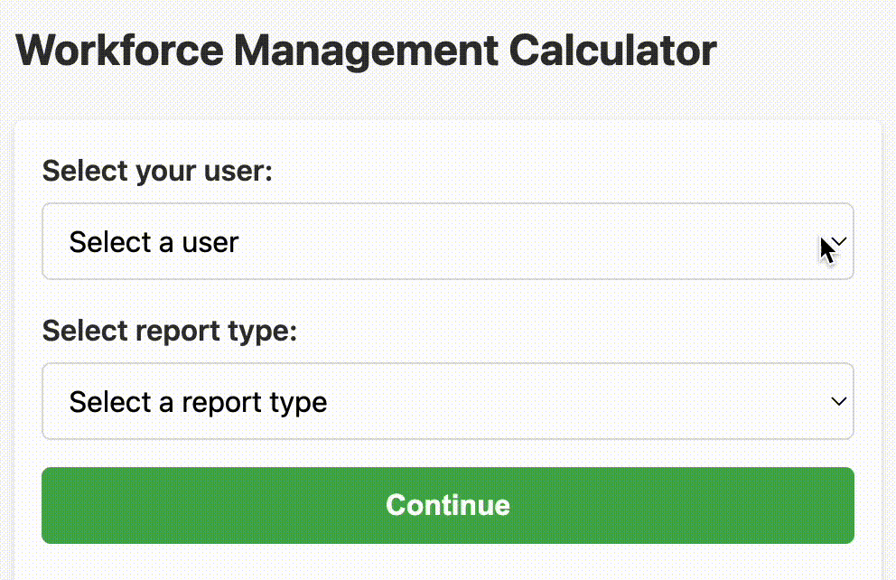
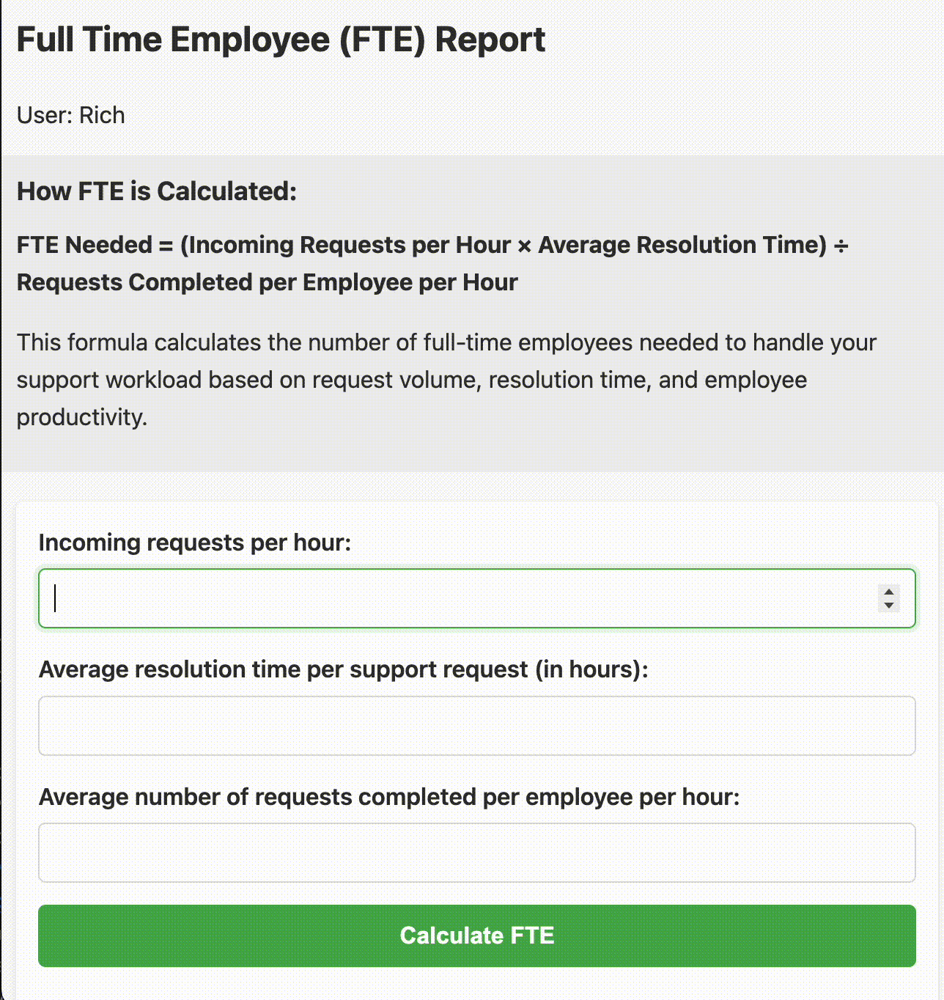

# Workforce Management Calculator

A web app to help contact center managers and workforce planners forecast staffing requirements using industry-standard methodologies. This tool provides calculations for two  workforce planning scenarios: **FTE projections** based on support request volume and **Erlang C staffing models** for inbound phone call operations.

### Report Selection

On the home page, select between FTE and Erlang C reports based on your planning needs.



### FTE (Full-Time Equivalent) Report

The FTE report calculates how many full-time staff members you need to handle a specific volume of support requests over a given time period. While traditional FTE calculations focus solely on available working hours, this implementation takes **support request volume** into account. 

The calculator considers:

- Total support request volume (incoming requests per hour)
- Average time to complete each request (resolution time in hours)
- Employee productivity (requests completed per employee per hour)

This gives you a more realistic staffing projection that accounts for actual workload, not just theoretical capacity.

> **Note:** The current version of the FTE calculator does not incorporate shrinkage factors (time off, training, breaks, meetings) into its inputs or calculations. 
> 
> When interpreting results, consider adding an additional buffer to account for shrinkage based on your organization's typical patterns (commonly 20-30% depending on your operational context).



The report generates a comprehensive projection table showing staffing needs across multiple scenarios of growth (more support requests, or greater efficiency, or longer resolution times, etc.) and includes CSV export functionality for further analysis or integration with your existing planning tools.


### Erlang C Report

The Erlang C report is specifically designed for real-time contact center operations where incoming calls or chats arrive randomly and need to be answered within specific service level targets.

The Erlang formulas were developed by Agner Krarup Erlang while working for the Copenhagen Telephone Company to solve the problem of how many telephone circuits were needed to handle fluctuating call volumes. His mathematical models, particularly the Erlang C formula, became the foundation for modern call center workforce planning, as they accurately predict the probability of callers waiting in queue and help determine the optimal number of agents needed to meet service level agreements.

This calculator helps you determine:

- How many agents you need to meet your service level targets
- What service level you can achieve with a given number of agents
- The relationship between staffing, wait times, and customer experience


Like the FTE report, the Erlang C report provides detailed projection tables and a CSV export. Also like the FTE report, it does not take shrinkage into account.


## Workforce Management Calculator App Key Features

- **Two Essential Report Types**: FTE for asynchronous work (tickets, emails) and Erlang C for real-time interactions (calls, chats)
- **Data Tables**: Review detailed projections
- **CSV Export**: Download results for offline/further analysis
- **User Management**: Create and save user profiles to associate with reports

## Getting Started

### Installation & Setup

1. **Clone the repository**
   ```bash
   git clone https://github.com/agiantbird/wfm_calculator.git
   cd wfm_calculator
   ```

2. **Install dependencies**
   ```bash
   bundle install
   ```

3. **Set up the database**
   ```bash
   rails db:create
   rails db:migrate
   rails db:seed
   ```

4. **Start the application**
   ```bash
   rails server
   ```

5. **Access the application**
   Open your browser and navigate to `http://localhost:3000`

You're now ready to start forecasting your workforce needs!
